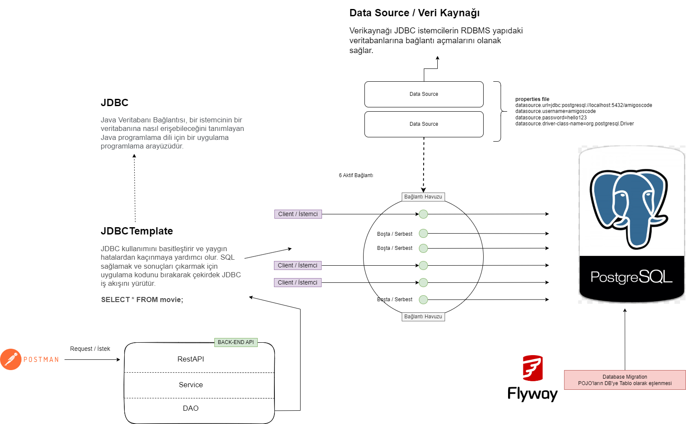
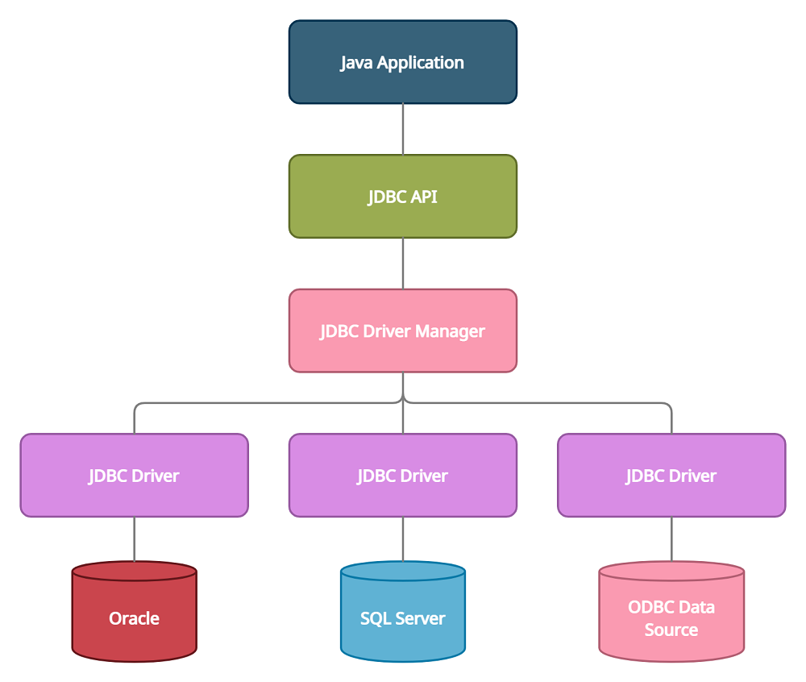

# Java ile Veritabanı Çalışması
- JDBC(Java Database Connectivity)
- Datasource
- Connection Pool
- Flyway and JDBC Template

<pre>
Java Database Connectivity, Java programlama dilinde yazılmış uygulamaların veritabanı ile etkileşime girmesini sağlayan bir uygulama programlama arayüzüdür(API).
JDBC ile hemen hemen tüm ilişkisel veri tabanı yönetim sistemlerine SQL sorgusu gönderilebilmektedir.
</pre>

# Diagramlarımız


---




# Basit Kod Egzersizi
- `actor` ve `movie` tablosu ekleyelim. 
<pre>Aşağıdaki SQL ifadesini InitTables.sql dosyasına taşıyabilirsiniz.</pre>
```sql
CREATE TABLE movie (
    id BIGSERIAL PRIMARY KEY,
    name TEXT NOT NULL,
    release_date DATE NOT NULL,
    unique (name)
);
CREATE TABLE actor(
    id bigserial primary key,
    name TEXT NOT NULL,
    movie bigint REFERENCES movie (id),
    unique (name, movie)
);
```
